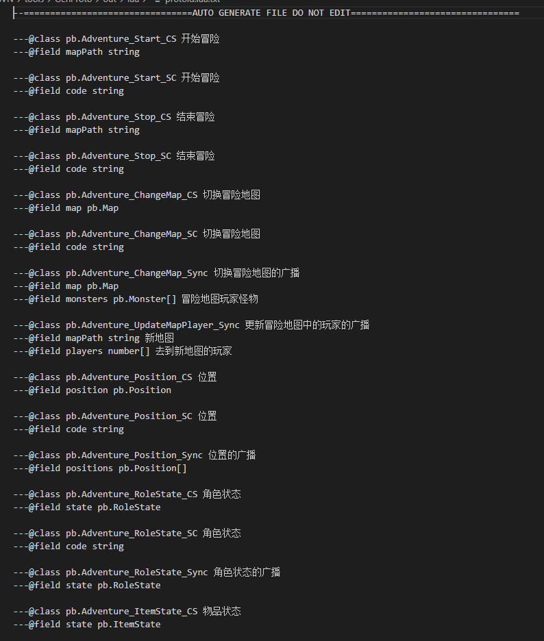
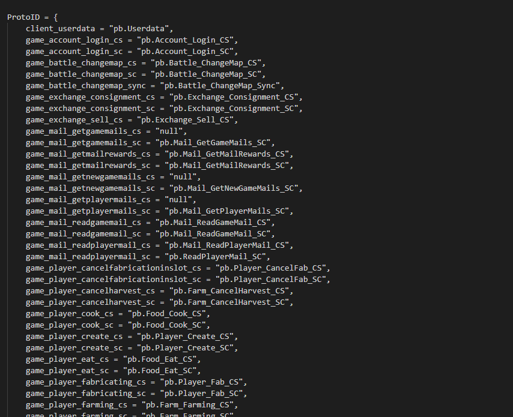

# protoc-define-lua
The emmylua protobuf description generator

## Technical details
* .NetCore 8.0 runtime.
* Use clang-format to format proto.
* All comment support(field and class).
* begin `//@` define proto id or route id. (see example)

